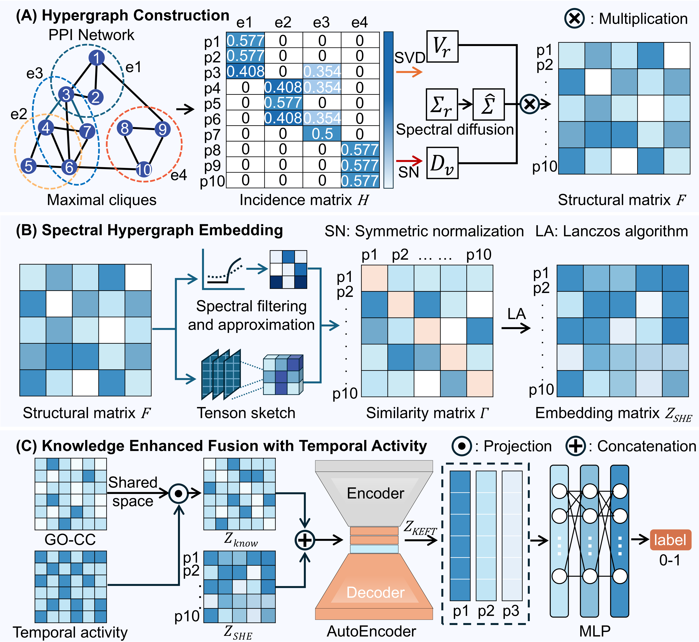

# KSHL-PC

## Abstract

Protein complexes are fundamental modular units of cellular organization, and their accurate identification is critical for network-based drug discovery. However, most computational approaches rely on pairwise interactions or heuristic clustering, limiting their ability to capture higher-order cooperative patterns in noisy protein-protein interaction (PPI) networks and often neglecting biological constraints such as subcellular colocalization and temporal coordination. To address these challenges, we propose KSHL-PC, a knowledge-augmented spectral hypergraph learning framework for protein complex identification. KSHL-PC constructs clique-induced hypergraphs to model multi-protein cooperation and employs spectral hypergraph embedding to capture multi-scale structural dependencies. A knowledge-enhanced feature transformation module integrates Gene Ontology cellular component annotations and temporal activity signals, while a permutation-invariant discriminator enables end-to-end complex scoring without hand-crafted rules. Experiments on multiple benchmark datasets show that KSHL-PC consistently outperforms state-of-the-art methods in F1-score, AUPRC, and complex-level accuracy. The predicted complexes also exhibit strong functional coherence, subcellular colocalization, and transcriptional coordination. These results demonstrate that KSHL-PC provides an effective framework for identifying biologically meaningful protein complexes and supports downstream network-based drug target discovery.

## Model



KSHL-PC contains three main stages:

1. Hypergraph construction builds clique-induced hyperedges from the PPI network.
2. Spectral hypergraph embedding computes structural protein representations from the incidence matrix.
3. Knowledge-enhanced fusion combines GO cellular component annotations, temporal activity features, and structural embeddings before complex scoring.

## Repository Structure

```text
KSHL-PC/
  assets/
    model.png
  data/
    Human/
    Saccharomyces_cerevisiae/
    labels/
    validation_data/
  experiments/
    ablation.py
    grid_she.py
    node_cls/
    validation/
  results/
  src/
    main.py
    she_core.py
    she_embed.py
    knowledge_features.py
    fusion.py
    Train_PC.py
    models.py
    layers.py
    evaluation.py
    utils.py
  requirements.txt
```

`data/` stores benchmark datasets and processed biological resources. `results/` stores generated metrics, predictions, figures, and case-study outputs.

## Environment

Create a Python environment and install dependencies:

```bash
conda create -n kshl-pc python=3.8
conda activate kshl-pc
pip install -r requirements.txt
```

The project uses PyTorch, DHG, NumPy, SciPy, scikit-learn, NetworkX, pandas, node2vec, and Matplotlib. Install the PyTorch build that matches the local CUDA runtime when GPU acceleration is required.

## Run

Run the main KSHL-PC training and evaluation pipeline:

```bash
python src/main.py --ppi_dataset Mann --model SHE --output_dir results/Mann
```

Run with another PPI benchmark:

```bash
python src/main.py --ppi_dataset DIP --model SHE --output_dir results/DIP
python src/main.py --ppi_dataset BioGRID --model SHE --output_dir results/BioGRID
```

Run the structural embedding grid search:

```bash
python experiments/grid_she.py --ppi_dataset Mann --out_dir results/grid_she
```

Run the ablation experiments:

```bash
python experiments/ablation.py --ppi_dataset Mann --out_root results/ablation
```

Run pooling ablation on precomputed embeddings:

```bash
python experiments/pooling_ablation.py --ppi_dataset Mann --embedding_type fused --out_root results/pooling_ablation
```

Run validation analysis:

```bash
python experiments/validation/validation_experiment.py
```

## Data Flow

1. `src/main.py` loads protein sequence metadata and a selected PPI dataset.
2. PPI pairs are mapped to internal protein indexes through `src/utils.py`.
3. Maximal cliques are extracted from the PPI graph and stored as hyperedges.
4. `src/she_embed.py` and `src/she_core.py` compute spectral hypergraph embeddings.
5. `src/knowledge_features.py` builds GO-CC and temporal activity features.
6. `src/fusion.py` produces fused protein embeddings.
7. `src/Train_PC.py` trains `PCpredict` and evaluates binary and complex-level metrics.
8. Prediction files and metric JSON files are written under `results/`.


